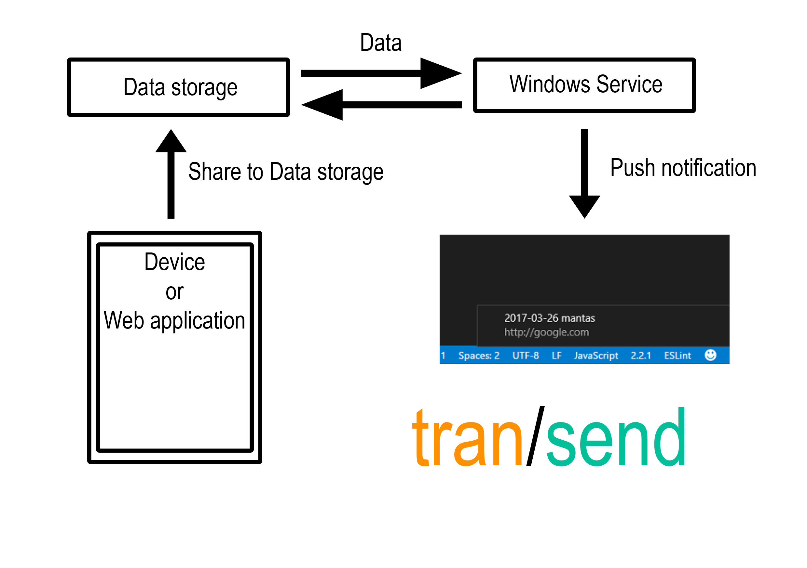

  
The project idea I got was when I needed to get a link from my phone to my computer and I was already looking for a side project to develop. I usually did using this kind of route:  
**Phone** -> **Share to Google Keep** -> **Open Browser** -> **Google Keep web page** -> **Click on the link**.  

Note: I haven't looked for application that can do it, because I wanted to do it :simple_smile:

## How to run
To jump start this project I used this:  
[https://developers.google.com/drive/v3/web/quickstart/nodejs](https://developers.google.com/drive/v3/web/quickstart/nodejs)  
- **client_secret.json** should be obtained :exclamation:  
Run these commands: 
- `npm run register` in the console, copy the url to browser and then paste authentication token to console
- `npm run reset` will reset the database file with a fake test notification
- `npm run install-service` installs window service and registers registry that toast in Action center persist after retrieved from data source

## Architecture

## Stack

| System   |   Technology  |  Status | Rewrites |
|----------|---------------|---------|----------|
| Windows Service |  [Node.js](https://github.com/nodejs)  | Done (for now) :ok_hand: |
| Data storage | [Google Drive (AppData)](https://developers.google.com/drive/v3/web/appdata)  | Done (for now) :ok_hand:  |  |
| Mobile app | [React native](https://facebook.github.io/react-native) |   TO DO |  |
| Web app (Client) | [React](https://facebook.github.io/react), [Vuejs](https://github.com/vuejs) | TO DO |  |
| Web app (Server) | [Node.js](https://github.com/nodejs), [.NET Core](https://github.com/dotnet/core) | TO DO |  |

